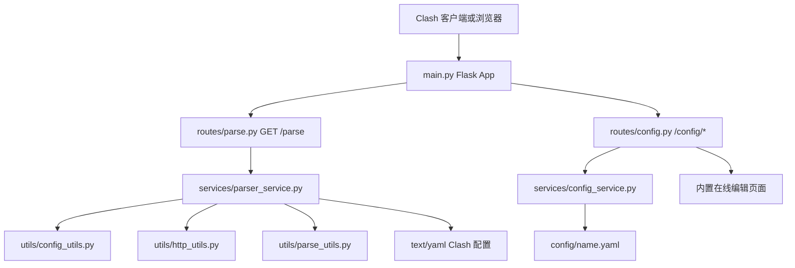
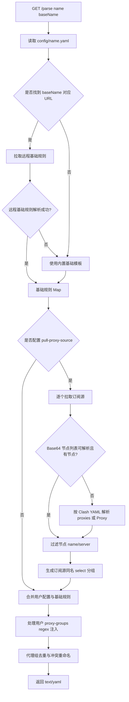
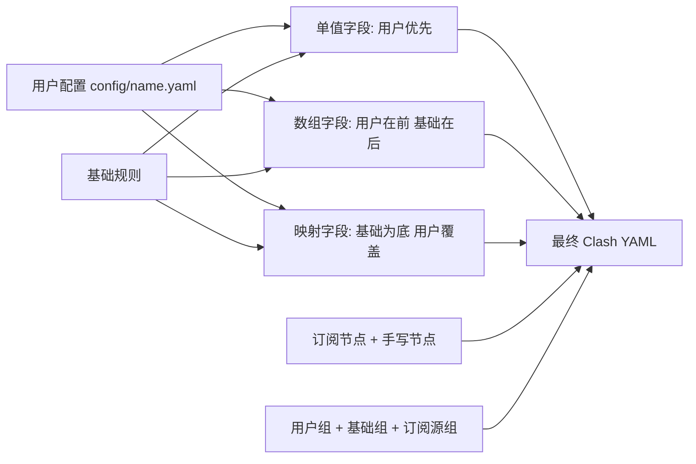

# ClashMerge

ClashMerge 是一个用 Flask 提供 HTTP 服务的 Clash 配置合并器。它把你的多个机场/自建节点订阅、手写节点、自定义分流规则，与一份基础 Clash 规则合并成一个可直接给 Clash 客户端使用的 YAML 配置。

它解决的问题很直接：你不想在多个订阅配置之间来回切换，也不想手工维护大量规则；只需要维护一份 `config/<name>.yaml`，客户端订阅 `http://服务器:端口/parse?name=<name>&baseName=<base>`，每次拉取时都会实时合并输出最新配置。

## 目录

- [核心能力](#核心能力)
- [项目结构](#项目结构)
- [运行方式](#运行方式)
- [配置文件](#配置文件)
- [接口说明](#接口说明)
- [实际合并逻辑](#实际合并逻辑)
- [Mermaid 流程图](#mermaid-流程图)
- [Docker 部署](#docker-部署)
- [开发说明](#开发说明)
- [常见问题](#常见问题)
- [鸣谢](#鸣谢)

## 核心能力

- 拉取多个订阅源：在 `pull-proxy-source` 中配置多个 `name + url`，程序会逐个请求并合并节点。
- 支持两类订阅格式：Clash YAML 订阅，以及 Base64 节点列表。
- Base64 节点列表支持解析 `vmess://`、`vless://`、`trojan://`、`ss://`。
- 支持手写静态节点：`proxies` 中的节点会直接进入最终配置。
- 支持过滤节点：`filter-proxy-name` 使用正则匹配节点名，`filter-proxy-server` 按 server 精确过滤。
- 支持过滤 provider 和分组：`filter-proxy-providers`、`filter-proxy-groups` 可剔除不需要的配置块。
- 支持代理组自动注入：用户配置的 `proxy-groups[*].proxies` 可写 `{ regex: "..." }`，按节点名正则把订阅节点注入分组。
- 支持在线编辑配置：内置 `/config/ui` 页面，可加载和保存 `config/<name>.yaml`。
- 提供 HTTP 订阅输出：`/parse` 返回 `text/yaml`，可直接作为 Clash 订阅地址。

## 项目结构

```text
ClashMerge/
├── main.py                  # Flask 入口，注册蓝图，启动 HTTP 服务
├── routes/
│   ├── parse.py             # /parse 路由
│   └── config.py            # /config/load、/config/save、/config/ui 路由
├── services/
│   ├── parser_service.py    # 配置读取、订阅拉取、合并输出主逻辑
│   └── config_service.py    # 配置文件加载、保存、文件名校验
├── utils/
│   ├── parse_utils.py       # Base64/YAML 订阅解析、节点过滤、分组生成
│   ├── config_utils.py      # 配置字段覆盖与合并工具
│   └── http_utils.py        # HTTP 拉取与请求 IP 获取
├── config/
│   └── .config.yaml         # 参考配置模板
├── log/                     # 运行后生成，日志写入 log/log.txt
├── requirements.txt         # Flask / PyYAML / requests
└── Dockerfile               # Python 3.12 slim 镜像
```

## 运行方式

### 1. 安装依赖

本项目是 Python 项目，依赖写在 `requirements.txt`：

```bash
pip install -r requirements.txt
```

如果你使用 conda，建议先进入对应环境后再安装依赖。

### 2. 准备配置

复制参考配置并改成自己的配置名：

```bash
cp config/.config.yaml config/my.yaml
```

Windows PowerShell 可以使用：

```powershell
Copy-Item -LiteralPath "config/.config.yaml" -Destination "config/my.yaml"
```

最少需要关注这几个字段：

```yaml
base-config:
  - name: Hackl0us
    url: "https://example.com/base-clash.yaml"

pull-proxy-source:
  - name: provider-a
    url: "https://example.com/subscription-a"
  - name: provider-b
    url: "https://example.com/subscription-b"

proxies:
  - name: "my-node"
    type: ss
    server: example.com
    port: 443
    cipher: chacha20-ietf-poly1305
    password: "password"
```

不要把真实订阅地址、密码、token 提交到公开仓库。

### 3. 启动服务

```bash
python main.py 6789
```

端口参数可省略，默认是 `6789`。服务会监听 `0.0.0.0`，日志同时输出到控制台和 `log/log.txt`。

### 4. 作为 Clash 订阅使用

把下面地址填到 Clash 客户端的订阅 URL 中：

```text
http://<server-ip>:6789/parse?name=my&baseName=Hackl0us
```

参数说明：

| 参数 | 必填 | 说明 |
| --- | --- | --- |
| `name` | 是 | 配置文件名，不包含 `.yaml` 后缀。例如 `my` 会读取 `config/my.yaml`。 |
| `baseName` | 否 | `base-config` 中的基础规则名称。传入后会按名称查找并拉取对应 URL。 |

如果 `baseName` 未提供，或远程基础规则拉取/解析失败，程序会使用 `parser_service.py` 内置的基础 Clash 模板继续输出。

## 配置文件

参考模板是 [config/.config.yaml](config/.config.yaml)。核心字段如下：

| 字段 | 合并方式 | 说明 |
| --- | --- | --- |
| `base-config` | 运行时选择 | 基础规则源列表。`/parse?baseName=...` 会从这里找 URL。 |
| `pull-proxy-source` | 逐个拉取并追加 | 代理订阅源列表，每个源会生成一个同名 `select` 分组。 |
| `filter-proxy-name` | 过滤 | 按节点名正则过滤订阅节点。 |
| `filter-proxy-server` | 过滤 | 按节点 `server` 精确过滤订阅节点。 |
| `filter-proxy-providers` | 过滤 | 从最终 `proxy-providers` 中删除同名 provider。 |
| `filter-proxy-groups` | 过滤 | 从用户、基础规则、订阅生成的代理组中删除同名分组。 |
| `proxies` | 追加 | 手写静态节点，放在订阅节点前面。 |
| `proxy-groups` | 生成后追加 | 用户自定义代理组，可用 `regex` 自动注入订阅节点。 |
| `rules` | 数组合并 | 用户规则在前，基础规则在后。 |
| `rule-providers` | 映射合并 | 以基础规则为底，用户同名 key 覆盖基础规则。 |
| `proxy-providers` | 映射合并 | 以基础规则为底，用户同名 key 覆盖基础规则，再应用过滤。 |

单值字段使用“用户配置优先，基础规则兜底”的策略，包括：

```text
port, socks-port, redir-port, mixed-port, allow-lan, bind-address,
mode, log-level, ipv6, external-controller, external-ui, secret,
interface-name, authentication, hosts, dns
```

### 代理组 regex 写法

如果代理组里没有 `use` 字段，程序会处理 `proxies` 列表：

```yaml
proxy-groups:
  - name: "美国"
    type: select
    proxies:
      - DIRECT
      - regex: "美国|US|United States"
```

处理逻辑：

- 字符串项会作为静态节点名保留，例如 `DIRECT`。
- `{ regex: "..." }` 会匹配所有订阅节点名，命中的节点自动加入该组。
- 如果没有任何 `regex` 项，则默认把所有订阅节点加入该组。
- 最终会去重并保持顺序。

## 接口说明

### `GET /parse`

合并并输出 Clash YAML。

示例：

```text
GET /parse?name=my&baseName=Hackl0us
```

响应：

- 成功：`200 text/yaml`
- 参数错误：`400 解析请求参数失败`
- 订阅处理异常：`500 获取代理信息失败`

当前代码中即使部分订阅源失败，也会尽量输出其他成功订阅源和手写节点；失败详情见 `log/log.txt`。

### `GET /config/load`

加载配置文件文本。

```text
GET /config/load?name=my
```

说明：

- 只允许文件名包含英文字母、数字、下划线、短横线。
- 读取路径固定为 `config/<name>.yaml`。
- 文件不存在时返回空文本，方便在线编辑器新建配置。

### `POST /config/save`

保存配置文件文本。

```text
POST /config/save?name=my
Content-Type: text/plain

port: 7890
```

说明：

- 保存前会用 `yaml.safe_load` 校验 YAML 格式。
- 禁止保存 `template` 这个名称。
- 文件名校验同 `/config/load`，用于避免路径穿越。

### `GET /config/ui`

打开内置在线编辑页面。

```text
http://<server-ip>:6789/config/ui
http://<server-ip>:6789/config/ui?name=my
```

页面支持：

- 输入配置名后加载 `config/<name>.yaml`。
- 编辑 YAML 后保存。
- 深色/浅色主题切换。
- 展开查看关键配置字段说明。

## 实际合并逻辑

`/parse` 的核心流程在 `services/parser_service.py`：

1. 读取 `name` 参数，加载 `config/<name>.yaml`。
2. 如果传入 `baseName`，在用户配置的 `base-config` 中查找同名基础规则 URL。
3. 尝试拉取并解析远程基础规则；失败时使用代码内置的基础 Clash 模板。
4. 遍历 `pull-proxy-source`，逐个请求订阅 URL。
5. 每个订阅先尝试按 Base64 节点列表解析，成功且有节点则使用 Base64 结果。
6. Base64 路径失败或无节点时，再尝试按 Clash YAML 解析。
7. 对订阅节点应用名称和 server 过滤。
8. 为每个订阅源生成一个同名 `select` 代理组。
9. 合并基础规则、用户配置、订阅节点、手写节点、代理组、规则和 provider。
10. 对同名代理组去重：类型相同则合并 `proxies`，类型不同则给后出现的组名追加 `$`。
11. 输出最终 YAML。

需要注意：当前代码没有定时缓存订阅内容，每次客户端请求 `/parse` 都会实时拉取远程基础规则和订阅源。

## Mermaid 流程图

### HTTP 路由与服务分层



### `/parse` 合并流水线



### 配置字段合并策略



## Docker 部署

### 构建镜像

```bash
docker build -t crazybun/mergevpn:2.4 .
```

### 运行容器

建议挂载 `config` 和 `log`，这样配置和日志不会随容器删除而丢失：

```bash
docker run -itd \
  --name mergevpn \
  --restart always \
  -e TZ=Asia/Shanghai \
  -v $(pwd)/config:/app/config \
  -v $(pwd)/log:/app/log \
  -p 6789:6789 \
  crazybun/mergevpn:2.4
```

验证：

```text
http://localhost:6789/parse?name=my&baseName=Hackl0us
http://localhost:6789/config/ui
```

Dockerfile 当前使用 `python:3.12-slim`，容器默认执行：

```bash
python main.py 6789
```

## 开发说明

新增接口时遵循现有分层：

1. 在 `routes/` 新建或修改蓝图，只处理 HTTP 参数和响应。
2. 在 `services/` 放业务逻辑。
3. 在 `utils/` 放可复用的解析、HTTP、配置工具。
4. 在 `main.py` 中注册新的 Blueprint。

示例：

```python
# routes/example.py
from flask import Blueprint, request
from services import example_service

example_bp = Blueprint("example", __name__)

@example_bp.route("/example", methods=["POST"])
def create():
    data = request.get_json()
    return example_service.create(data)
```

```python
# main.py
from routes.example import example_bp

app.register_blueprint(example_bp)
```

## 常见问题

### 为什么访问 `/parse` 返回 400？

通常是没有传 `name`，或 `config/<name>.yaml` 读取失败。检查 URL 是否类似：

```text
/parse?name=my&baseName=Hackl0us
```

### 为什么订阅源没有节点？

先看 `log/log.txt`。常见原因：

- 订阅 URL 无法访问或返回非 200。
- 订阅内容既不是可解析的 Base64 节点列表，也不是 Clash YAML。
- `filter-proxy-name` 或 `filter-proxy-server` 把节点过滤掉了。

### 为什么基础规则没有生效？

确认 `baseName` 与配置中的 `base-config[*].name` 完全一致。找不到或拉取失败时，程序会使用内置基础模板，不会中断输出。

### 在线编辑保存失败怎么办？

检查三点：

- 文件名只能包含英文字母、数字、下划线、短横线。
- 不能保存为 `template`。
- YAML 必须能被 `yaml.safe_load` 解析。

### 日志在哪里？

本地运行和 Docker 运行都会写到：

```text
log/log.txt
```

## 特别说明

这个项目更适合部署在服务器上长期运行，让 Clash 客户端直接订阅 `/parse` 输出。这样每次客户端刷新订阅时，都会实时拉取并合并最新的基础规则和代理订阅。

`base-config` 不是最终输出字段，而是 ClashMerge 自己用来选择基础规则源的运行时配置。最终输出会根据基础规则、用户配置和订阅内容重新生成。

## TODO

- [ ] 为 `/parse`、订阅解析、配置保存补充自动化测试。
- [ ] 增加 lint/type-check/CI 检查。
- [ ] 支持更多协议或更完整的 Clash Meta 字段。
- [ ] 增加按客户端能力过滤节点的选项，例如 OpenClash、Clash Verge、FlClash。
- [ ] 增强在线编辑器，例如格式化 YAML、快捷键保存、配置差异预览。

## 鸣谢

- [原作者 crazyhl](https://github.com/crazyhl/PullAndMergeConfig)
- [Hackl0us](https://github.com/Hackl0us)
- [ConnersHua](https://github.com/ConnersHua)
